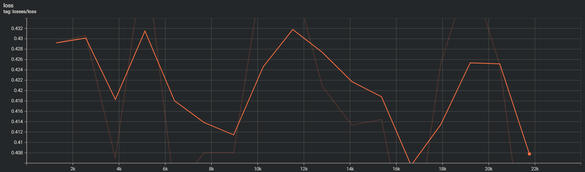

# Eksperymenty BlokusRL

## Spis treści

- [Eksperymenty BlokusRL](#eksperymenty-blokusrl)
  - [Spis treści](#spis-treści)
  - [PPO](#ppo)
    - [CartPole](#cartpole)
    - [Blokus](#blokus)
      - [Środowisko](#środowisko)
      - [Wyniki](#wyniki)
  - [AlhpaZero](#alhpazero)
    - [Blokus Uproszczony](#blokus-uproszczony)
      - [Wyniki](#wyniki-1)
    - [Blokus Pełny](#blokus-pełny)
      - [Model](#model)
      - [Optymalizacja hyperparametrów](#optymalizacja-hyperparametrów)
      - [Trening](#trening)
      - [Wyniki](#wyniki-2)
      - [Kluczowe wnioski:](#kluczowe-wnioski)
  - [Wnioski:](#wnioski)

## PPO

Po zapoznaniu się z teorią uczenia ze wzmocnieniem i dostępnymi algorytmami postanowiłem zaimplementować jeden z nich. Wybór padł na algorytm PPO (Proximal Policy Optimization). Algorytm ten został opisany w artykule [Proximal Policy Optimization Algorithms](https://arxiv.org/abs/1707.06347) przez firme OpenAI. Algorytm ten dawał dobre wyniki w grach Atari, więc postanowiłem sprawdzić jak zachowa się w grze planszowej Blokus. Dodatkowo impelementacja tego algorytmu jest stosunkowo prosta w porównaniu do innych policy-based algorytmów takich jak np. Rainbow. Swoją implementację wzrorowałem na otwarto źródłowej implementacji z projektu [cleanrl](https://github.com/vwxyzjn/cleanrl).

### CartPole

Pierwszym krokiem było sprawdzenie czy algorytm działa poprawnie. Do tego celu wykorzystałem środowisko [CartPole-v1](https://gymnasium.farama.org/environments/classic_control/cart_pole/). Środowisko to polega na utrzymaniu równowagi drążka na wózku. Wózek może poruszać się w lewo lub prawo. Za każdym razem gdy drążek przekroczy kąt 15 stopni lub wózek wyjedzie poza obszar środowiska gra się kończy. Celem jest utrzymanie drążka w pionie jak najdłużej. Środowisko to jest bardzo proste, więc algorytm powinien nauczyć się grać w nie w krótkim czasie. Otrzymane wyniki przedstawiam poniżej:

|  |
| :----------------------------------------------------------------------: |
|                  *Wykres nagród w kolejnych epizodach*                   |

|  |
| :--------------------------------------------------: |
|         *Wykres strat w kolejnych epizodach*         |

Jak widać na wykresach algorytm szybko nauczył się grać w to środowisko. Warto zauważyć, że w przypadku tego środowiska nie ma potrzeby wykorzystywania sieci konwolucyjnych, więc sieć neuronowa składa się tylko z dwóch warstw gęstych. W przypadku środowiska Blokus konieczne będzie wykorzystanie sieci konwolucyjnych.

Dodatkowo załączam filmik z działania agenta w tym środowisku:

<video width="630" height="300" src="./images/PPO/rl-cart_pole-video-episode-343.mp4"></video>

### Blokus

Po upewnieniu się że algorytm działa poprawnie w środowisku CartPole przyszedł czas na sprawdzenie jak zachowa się w środowisku Blokus. Środowisko to jest dużo bardziej skomplikowane niż CartPole, więc algorytm będzie potrzebował więcej czasu na nauczenie się grać w to środowisko. Dodatkową trudnością jest to ze Blokus jako gra planszowa, która ma zmieną liczbę akcji w zależności od stanu gry. W przypadku CartPole liczba akcji jest stała i wynosi 2. Rozwiązałem ten problem przez maskowanie niedostępnych akcji, więc agent nie będzie mógł wybrać akcji która nie jest dostępna. Równiez system nagród jest inny niz w grach typu Atarii. W grach Atari nagroda jest przyznawana za każdy krok, natomiast w Blokus nagroda jest przyznawana tylko na koniec gry. W przypadku Blokus dla dwóch osób za wygraną dostaje się 1 punkt za remis 0 i za przegraną -1.

#### Środowisko 

W celach testowych jak PPO poradzi sobie z grą Blokus zacząłem od uproszczonej wersji gry tzn. od dwóch graczy i planszy 7x7. W tych ustawieniach przestrzeń akcji wynosi 919. Wykorzysywałem implementacje środowiska Blokus dostępną przez Pythonowe API [gymnasium](https://gymnasium.farama.org/). W tej wersji nie implementowałem jeszcze mechanizmu self-play i agent grał przeciwko losowemu graczowi.

#### Wyniki

Niestety w przypadku Blokusa nie udało mi się nauczyć agenta grać w to środowisko. Agent nie radził sobie nawet grając z randomowym graczem uzyskają średni wynik nagród koło 0. Dodatowo cały trening był bardzo niestabilny i juz po kilku około 20k iteracji loss stawał się NaN i trening się kończył. Poniżej przedstawiam wykresy z treningu:

|  |
| :-----------------------------------------------------------------: |
|                *Wykres nagród w kolejnych epizodach*                |

|  |
| :-------------------------------------------------: |
|        *Wykres strat w kolejnych epizodach*         |

Po analizie problemu doszedłem do wniosku, że problemem jest to, że agent nie ma możliwości nauczenia się jakie akcje są dobre, a jakie złe. W przypadku gier typu Atari agent dostaje nagrodę za każdy krok, więc może nauczyć się jakie akcje są dobre, a jakie złe. W przypadku Blokusa agent dostaje nagrodę tylko na koniec gry, więc ma znacznie utrudnione zadanie w wynioskowaniu, które akcje doprowadziły go do sukcesu, a które były błedne. W tej sytuacji musiałem zrezygonować z algorytmu PPO i zaimplementować inną metodę uczenia ze wzmocnieniem.

## AlhpaZero

Po niepowodzeniu z PPO postanowiłem zaimplementować algorytm AlphaZero. Algorytm ten został opisany w artykule [Mastering Chess and Shogi by Self-Play with a General Reinforcement Learning Algorithm](https://arxiv.org/abs/1712.01815) przez firmę DeepMind. Algorytm ten został z powodzeniem zastosowany w grach planszowych takich jak szachy, go czy shogi uzyskując nadludzkie wyniki, więc postanowiłem sprawdzić jak zachowa się w grze Blokus. Algorytm ten opiera sie na mechanizmie self-play, który pozwala uczyć się agentowi przez grę samym z sobą. Dodatkowo algorytm ten nie wymaga wiedzy eksperta, więc nie trzeba go uczyć jak grać w Blokusa. Wadą tego algorytmu jest to, że wymaga on dużej ilości czasu na trening, więc nie jest on odpowiedni do szybkiego prototypowania. Swoją implementację wzrorowałem na otwarto źródłowej implementacji z projektu [alpha-zero-general](https://github.com/suragnair/alpha-zero-general).

### Blokus Uproszczony

W orginalej wersji AlphaZero jest przeznaczona dla gier z dwoma graczami, więc swoje eksperymenty zacząłem z tą ilością graczy. Podobnie jak w przypadku eksperymentu z PPO plansza miała rozmiar 7x7 co dawało przestrzeń akcji 919. W tej wersji agent grał sam przeciwko sobie i uczył się na podstawie swoich ruchów. Po określonej ilości epizodów self-play sieć agenta była uczona na dostępnych próbkach po czym nowo wytrenowany model grał areny kontrolne przeciwko swojej poprzedniej wersji. Jeśli nowy agent wygrał ponad 60% gier był akceptowany jako nowy najlepszy model. W przeciwnym wypadku był odrzucany i proces uczenia rozpoczynał się od nowa. Po upewnieniu się, że moja implementacja działa poprawnie puściłem trening z następującymi parametrami:

* Liczba gier w epizodzie self-play: 100
* Ilość symulacji MCTS podczas self-play: 25
* Ilość epok uczenia: 10
* Ilość rozegranych aren kontrolnych: 40
* Próg akceptacji nowego modelu: 60%

#### Wyniki

Po ponad 100 pętlach treningowych, które zajeły około 160h na karcie NVIDIA rtx 3070 ti zdecydowałem się zatrzymać trening. W tym przypadku nie było już problemów z stabilnością treningu i całkowity loss po tym czasie zszedł do dosyć niskiego poziomu chociaż miał jeszcze miejsce do spodów, więc potencjalnie dalszy trening mógłby dać lepsze wyniki. Poniżej przedstawiam wykresy z treningu:

|  |
| :---------------------------------------------------------------------: |
|                        *Wykres całkowitego loss*                        |

|  |
| :-----------------------------------------------------------------: |
|                       *Wykres lossu wartości*                       |

|  |
| :-------------------------------------------------------------------: |
|                        *Wykres lossu polityki*                        |

|  |
| :---------------------------------------------------------------------------: |
|                            *Wykres wersji modelu*                             |

Jak widać na wykresach loss spadał dość szybko, a wersja modelu rosła co znaczy że nowsze modele były lepsze od poprzednich. Dodatkowo załączam filmik z działania agenta w tym środowisku:

**TODO**

Na koniec eksperymentu przeprowadziłem ewaluacje najlepszego modelu z 103 epoki przeciwko losowemu graczowi i swoim poprzednim wersjom. Kazdy z meczy składał się z 50 gier, a wyniki przedstawiam w tabeli poniżej:

| Mecz            | Wyniki  |
| --------------- | ------- |
| best vs losowy  | 40/7/3  |
| best vs step 3  | 43/4/4  |
| best vs step 27 | 14/35/1 |
| best vs step 64 | 8/36/6  |
| best vs step 90 | 8/37/5  |

Wyniki są przestawione w formie: ilość wygranych pierwszego gracza / ilość remisów / ilość wygranych drugiego gracza. 

Jak widać najlepszy model znacząco wygrał mecze przeciwko losowemu graczowi i pierwszymi swoimi wersjami. Wraz z dalszymi wersjami mecze stawały się bardziej wyrównane i znacznie dominowała ilość remisów.

### Blokus Pełny

Po udanych eksperymentach z uproszczoną wersją gry postanowiłem przeprowadzić eksperyment z pełną wersją gry. W tym przypadku grało 4 graczy, a plansza miała rozmiar 20x20 co dawało przestrzeń akcji **TODO**. Niestety obecna wersja kodu była zaprojektowana z myślą o grze z dwoma graczami, więc musiałem dokonać kilku znaczących zmian w kodzie. Zainspirowany artykułem [Multiplayer AlphaZero](https://arxiv.org/abs/1910.13012) wprowadziłem zmiany w mechanizmie self-play i zwektoryzowałem obliczenia tam gdzie się to dało w celu przyśpieszenia treningu. Drugim problemem, który napotkałem było środowisko Blokus, które sprawdzało się dobrze w przypadku dwóch graczy, ale w przypadku czterech graczy było zbyt wolne. W tym eksperymencie skorzystałem z środowiska dostępnego w pakiecie [colosseumrl](https://github.com/colosseumrl/colosseumrl), które działało lepiej w przypadku pełnej planszy i 4 graczy. W tej wersji za wygraną gracz dostaje 3 punkty, w przypadku remisu dwóch graczy obaj dostają po 1 punkt, a przegrany gracz otrzymuje -1.

#### Model

Wraz ze wzrostem złożoności środowiska potrzebne było zwiększenie rozmiaru sieci neuronowej odpowiedzialnej za podejmowanie decyzji przez agenta. Skorzystałem z architektury podobnej do tej z sieci [ResNet](https://arxiv.org/abs/1512.03385), która jest szeroko stosowana w zadananiach związanych z computer vision. Model składa się z zestawionych bloków warst konwolucyjnych przeplatanych normalizacją baczową i funkcją aktywacji ReLU. Model posiada dwie głowy: jedną Policy-head i drugą Value-head. Policy-head na wyjściu podaje rozkład prawdopodobieńska następnego ruchy, a Value-head przewiduje wynik gry dla danego stanu. Łączna ilość parametrów modelu wynosi 24.28M.

#### Optymalizacja hyperparametrów

W celu optymalizacji hyperparametrów skorzystałem z pakietu [optuna](https://optuna.org/). W tym celu zdefiniowałem funkcję celu, która przyjmuje następujące parametry:

* learning_rate - współczynnik uczenia
* batch_size - rozmiar batcha
* num_layers - ilość warstw konwolucyjnych
* epochs - ilość epok uczenia

Aby zebrać próbki na których mógłbym optymalizować hyperparametry przeprowadziłem 10 epizodów self-play z następującymi parametrami:

* Liczba gier w epizodzie self-play: 100
* Ilość symulacji MCTS podczas self-play: 25

Po zebraniu próbek przeprowadziłem optymalizację hyperparametrów przez 100 iteracji. Najlepsze wyniki otrzymałem dla następujących parametrów:

* learning_rate: 0.00005
* batch_size: 64
* num_layers: 3
* epochs: 40

#### Trening

Kluczowym parametrem, który musiałem zwiększyć dla tego środowiska jest `Ilość symulacji MCTS podczas self-play`. Określa on ile symulacji MCTS ma rozergrać agent przed podjęciem decyzji o swoim kolejnym ruchu. Znacząco wływa on na ilość informacji jakie agent ma o środowisku w określonym stanie co przekłada się na podejmowanie lepszych decyzji. Wadą zwiększania tego parametru jest znaczy wzrost czasu potrzebnego na wykonanie jednego ruchu co przekłada się na ilość gier jakie agent jest w stanie rozegrać. Biorąc pod uwagę balans mięszy siła gry, a czasem potrzebnym na wykonanie ruchu ustawiłem ten parametr na `200`. W orginalnej implementacji AlphaZero dla szachów ten parametr był ustawiony na `800`.

W tym eksperymencie puściłem 100 epizodów self-play z ilością sumulacji MCTS ustawioną na `200`. Zbieranie danych trwało około 60h. Po zebraniu próbek przeprowadziłem 40 epok uczenia sieci neuronowej agenta. Poniżej przedstawiam wykresy z treningu:

|  |
| :-----------------------------------------------------------: |
|                       *Wykres lossu*                         |

#### Wyniki

Na koniec w celu ewaluacji wytrenowanego modelu przeprowadziłem 24 aren kontrolnych. Przeciwnikiem agenta był klasyczny algorytm Monte Carlo Tree Search z ilością symulacji ustawioną na `200`. Wyniki przedstawiam w tabeli poniżej:

| Player         | Score |
| -------------- | ----- |
| agent_1        | 24    |
| uninformed_200 | -8    |
| uninformed_200 | -8    |
| uninformed_200 | -8    |

#### Kluczowe wnioski:

* Agent osiągnął obiecujący średni wynik 24 przeciwko -8, gdy zmierzył się z przeciwnikiem opartym wyłącznie na Monte Carlo Tree Search (MCTS).
* Wydajność jest znacząca, zwłaszcza biorąc pod uwagę złożoność Blokusa jako strategicznej, przestrzennej gry planszowej i ograniczoną ilość danych szkoleniowych.
* Wyniki sugerują, że istnieje znaczne pole do dalszych ulepszeń. Biorąc pod uwagę, że możliwości AlphaZero są często wzmacniane wraz ze wzrostem ilości danych szkoleniowych i zasobów obliczeniowych, wydajność agenta może ulec znacznej poprawie dzięki rozszerzonemu szkoleniu.
* Kluczowym spostrzeżeniem wynikającym z tych badań jest potwierdzenie, że AlphaZero wymaga znacznej mocy obliczeniowej, aby osiągnąć swój pełny potencjał. Osiągnięcie nadludzkich poziomów wydajności, jak widać w innych zastosowaniach AlphaZero, jest ściśle związane z dostępnością rozległych zasobów obliczeniowych i dużych zbiorów danych do treningu.

## Wnioski:

Badanie z powodzeniem wykazało wykonalność i początkową skuteczność zastosowania uczenia ze wzmocnieniem opartego na AlphaZero w grze Blokus, nawet przy ograniczonych danych. Obiecujące wyniki osiągnięte przez agenta AI stanowią solidną podstawę dla przyszłych badań, mających na celu wykorzystanie pełnego potencjału AlphaZero w złożonych, wieloosobowych grach planszowych i innych domenach strategicznych. Badania podkreślają zarówno możliwości, jak i kwestie zasobów niezbędne do przesunięcia granic sztucznej inteligencji w grach strategicznych.
